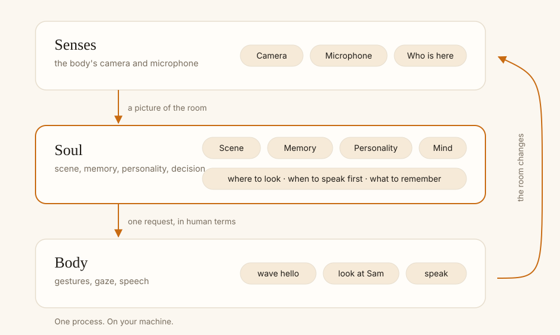

# ASIMOOV

**The open-source soul for companion robots.**

> **Status: pre-alpha, not released.** The contracts are frozen
> (`CONTRACTS_FROZEN.md`); the runtime, voice, perception and body adapters
> are under active development. `pip install asimoov` does not work yet.

ASIMOOV is the social layer that gives a companion robot a soul. It
recognises the people around it, remembers them between sessions, looks at
whoever is speaking, and triggers behaviours like *shake hands* that every
body translates in its own way. It runs entirely on your own machine, works
with a 3D-printed InMoov, a Unitree Go2 or just an avatar in your browser,
and a personality is a single readable file you can edit and share.



## What it does

**It remembers.** You tell it your name once. Tomorrow, next week, after a
reboot — it still knows you, what you talked about, who else was there.

**It pays attention.** It sees who is in the room and turns towards whoever
is speaking. When someone new walks in, it notices.

**It acts first.** It says hello when you get home. It tells you a stranger
is at the door. You set how forward it is, and when it should stay quiet.

**It has a character.** Curious, playful, a little cheeky, or calm and
formal. Its personality lives in a file you can read, edit and give to
someone else.

**It feels like something is going on inside.** Eyes that follow you, blink
and drift. A pause before an answer. A change of expression when the mood of
the room changes.

## Supported bodies

| Body | What it is | Status |
| --- | --- | --- |
| **Avatar** | Eyes in your browser. No robot, no hardware, no account — just a webcam and a microphone. The best way to start. | Ready |
| **InMoov** | The open-source 3D-printed humanoid. Head, arms, hands, jaw. Works from a single finger on a single pin. | Ready |
| **Unitree Go2** | The quadruped. Gestures, gaze by body rotation, battery and posture, front camera. No flips, ever. | Ready |
| **Reachy Mini** | The desk robot from Pollen Robotics and Hugging Face. | In progress |

Your robot is not here? A body adapter is one class with nine methods and a
manifest, and a conformance suite tells you when you are done. See
[CONTRIBUTING.md](CONTRIBUTING.md).

## Quick start

You need Python 3.10 or newer, a microphone, and an API key from your voice
provider.

```bash
pip install asimoov
export OPENAI_API_KEY=...
asimoov run robots/avatar
```

Open `http://localhost:7331/face` and say hello. Tell it your name. Say
goodbye. Come back tomorrow and see what happens.

```bash
asimoov run robots/go2       # the quadruped
asimoov run robots/inmoov    # the printed bust
asimoov doctor               # check what your machine can do
asimoov enroll --name Sam    # teach it a face from the command line
```

Extras keep the core install small: `asimoov[go2]`, `asimoov[inmoov]`,
`asimoov[vision]`, `asimoov[vad]`, `asimoov[kivy]`.

A personality is a file:

```yaml
apiVersion: asimoov/v1
kind: Persona
name: "Néon"
traits: [warm, playful, a little cheeky, curious]
initiative:
  level: medium
  greet_on_arrival: true
  quiet_hours: ["22:00", "08:00"]
rules:
  - "Never jump, never flip."
```

## Privacy

Everything runs on your machine. **There is no ASIMOOV server.**

- Camera images are never stored and never sent anywhere. A face becomes a
  short list of numbers on your disk, and nothing else.
- The only thing that leaves your network is the conversation itself — text
  and speech — sent to the voice provider you chose.
- Nobody is recognised by accident. A person is only remembered when someone
  says so out loud.
- Say "forget me" and the record, the facts and the face data are deleted.
- Memory is one SQLite file. Open it, read it, back it up, or delete it.

## Project layout

```
src/asimoov/contracts/   frozen v1 dataclasses, ABCs and JSON Schemas
src/asimoov/core/        bus and hub, scene, mind, behaviors, memory, CLI
src/asimoov/voice/       VoiceProvider, session, capture and playback
src/asimoov/perception/  cameras, face detection and recognition, VAD
src/asimoov/bodies/      body adapters and the conformance suite
src/asimoov/faces/       face server, web canvas, Kivy renderer
robots/                  ready-made robot.yaml + persona.yaml
apps/                    optional behaviour packs
firmware/                InMoov Arduino firmware
android/                 Docker + buildozer packaging for the APK
site/                    asimoov.com (Astro + Starlight)
docs/                    contracts, architecture, per-body notes
```

## Contributing

Bring a body, a personality, a fix, or a bug report — see
[CONTRIBUTING.md](CONTRIBUTING.md). The contracts in
`src/asimoov/contracts/` are frozen and additive only; everything else is
open ground.

## License

Apache 2.0, see [LICENSE](LICENSE).
